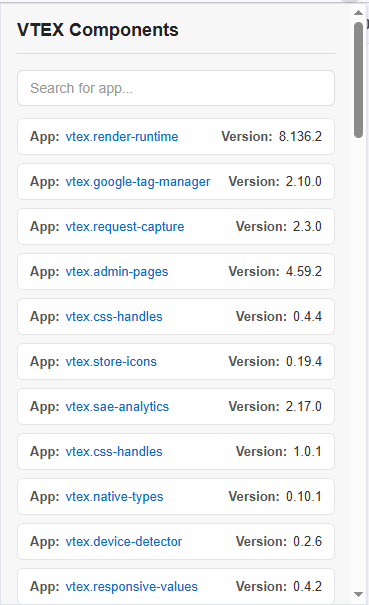
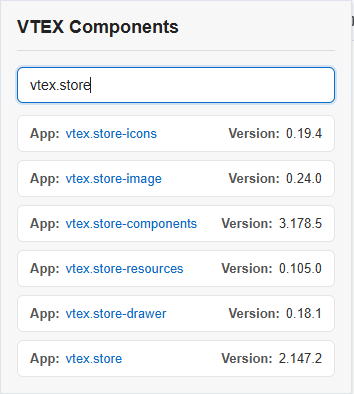

# VTEX Components Extension

A Google Chrome extension that allows you to quickly view the **apps** and their respective **versions** loaded on a VTEX store.

 

## ✨ Features

* Lists all apps loaded on the page.
* Displays the version of each app.
* Search by app or component.
* Simple and fast interface for VTEX developers.

## 📦 Example

```text
App: vtex.store-components      Version: 3.170.0
App: vtex.slider                Version: 0.15.0
App: vtex.login                 Version: 2.135.1
```

## 🚀 Installation (Developer Mode)

1. Clone this repository:

```bash
git clone https://github.com/Everton-Afonso/VTEX-Version-Inspector
```

2. Open Chrome.

3. Go to:

```
chrome://extensions
```

4. Enable **Developer mode**.

5. Click **Load unpacked**.

6. Select the project folder.

The extension will be available in the Chrome toolbar.

## 💻 How to Use

1. Open any VTEX store.
2. Click the extension icon.
3. View all apps loaded on the page.
4. Use the search box to find a specific app or component.

## 🔎 Search

Search is performed in real time.

Search examples:

* `store-components`
* `slider`
* `product-summary`
* `search-result`

## 🛠️ Technologies

* JavaScript
* Chrome Extensions (Manifest V3)
* Chrome Runtime API
* Chrome Tabs API

## 📂 Project Structure

```text
.
├── content/
│   ├── content.js
│   └── page-script.js
│
├── popup/
│   ├── popup.html
│   ├── popup.css
│   └── popup.js
│
├── icons/
│
├── manifest.json
└── README.md
```

## 📋 Compatibility

* Google Chrome
* Microsoft Edge (Chromium)
* Brave
* Other Chromium-based browsers

## 🤝 Contributions

Contributions are welcome.

If you find any issues or have suggestions for improvements, feel free to open an *Issue* or submit a *Pull Request*.

## 📄 License

This project is licensed under the MIT License.
